# Jan 21 experiment: Automatic Relevance Determination

We're trying to take the project in the direction of learning interesting regularization schemes that would not be possible without hyper-gradients.

As the simplest proof of concept we could think of, we learned a separate L2 regularization for each weight in a logistic regression.  The visualized weight penalties look pretty cool:

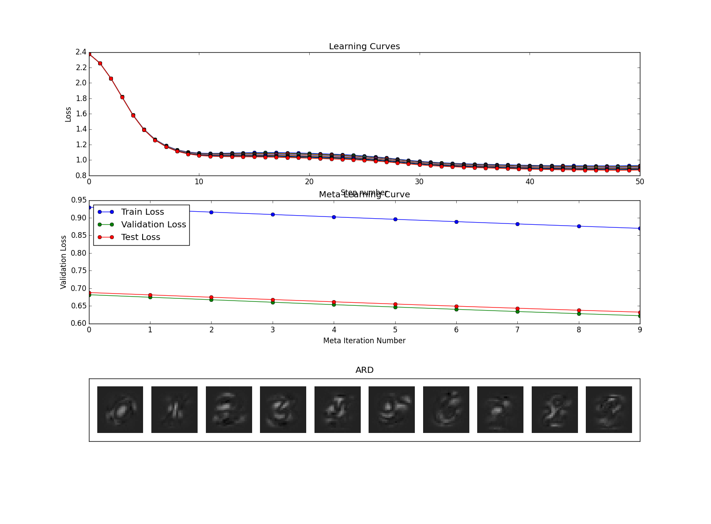

We also realized that convnets just a fancy form of regularization of fully-connected nets (sort of.)
To appear soon: Generalizations of convnets!

# Jan 19 experiment: Data augmentation

Trying to learn an augmentation transformation. It gives some improvement but
the transformation itself isn't very interesting. Let's try restricting to local
transformations.

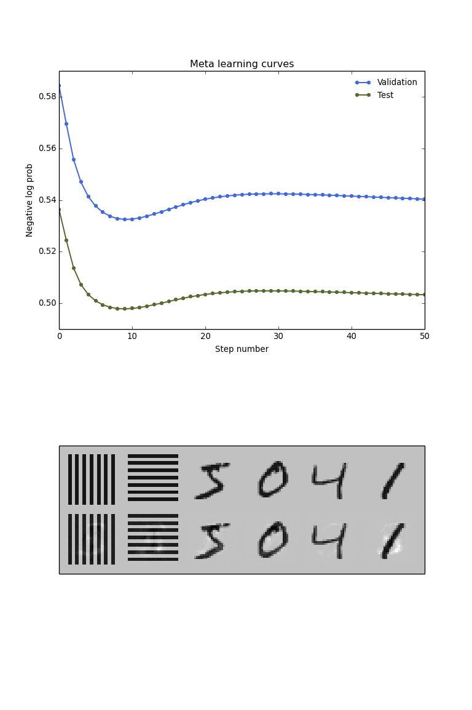

# Jan 19 experiment: Optimizing fake data

Given only 10 training examples, what should those examples look like in order to maximize the performance on a validation set?

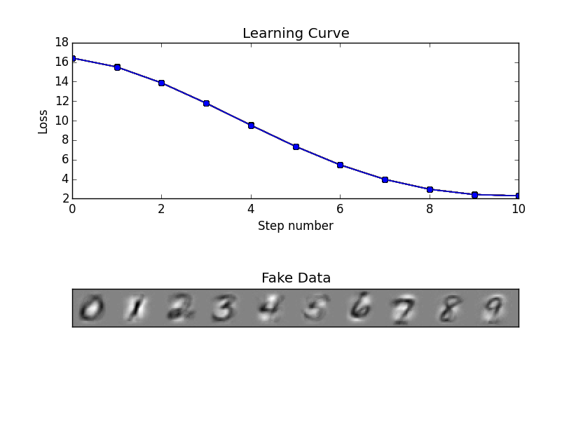

The gradients of the cross-validation loss w.r.t. the individual pixels of the training data produce 'canonical examples' of each digit.

We can also see how much we overfit when optimizing the error on a validaiton set of size 10000, as well as how the training, validation and test-set error change over time:

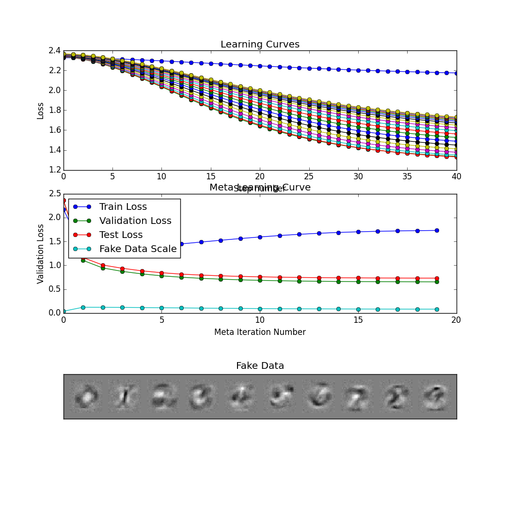

# Jan 19 experiment: having a go at learning data augmentation

Let's restrict ourselves to linear transformations of the data and try to learn
the transformation matrix. May need to include smoothing to encourage it to be
sparse and/or local. (e.g. could penalize or eliminate matrix elements between
non-adjacent pixels). Since we're hoping to do this with gradients, perhaps we
should only look at continuous deformations, of the form `y = matrixexp(A *
t).dot(x)`. This will also let us have continuous compositions of
transformations. If we put a Gaussian over all the `t` parameters, we would get
a distribution over transformations. We may also want to enforce the eigenvalues
of A to be imaginary so that the transformation doesn't grow or shrink
anything. (Although this wouldn't let it capture things like smoothing.)
Actually, thinking about this more, the bidirectional transformations like
translation will have imaginary eigenvalues, whereas the directional ones like
smoothing will have real eigenvalues, so maybe we can just do the transformation
with both the learned matrix and its transpose? (There's still going to be a
symmetry-related zero gradient though. Can we somehow solve this with
reparameterization?)

# Jan 16 experiment: Trying to optimize initial weight distributions

We'd like to say something about what the optimal weight distribution looks like.  However, it's tricky to sensibly set learning rates for the hyperparameters.

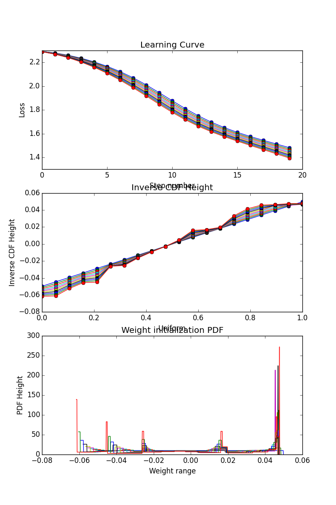

It looks like a few weights have much larger gradients than others (possibly the bias terms?).
To deal with this, we tried learning a separate initial distribution per layer:

It's not clear what's going wrong here - is it learning rates, or are the initial distributions way off?
The bias distributions will probably end up looking bad no matter what, since they have fewer weights than bins, but why do they look better than the filter parameter distributions?

I tried a simply experiment with only one layer and more meta-iterations:

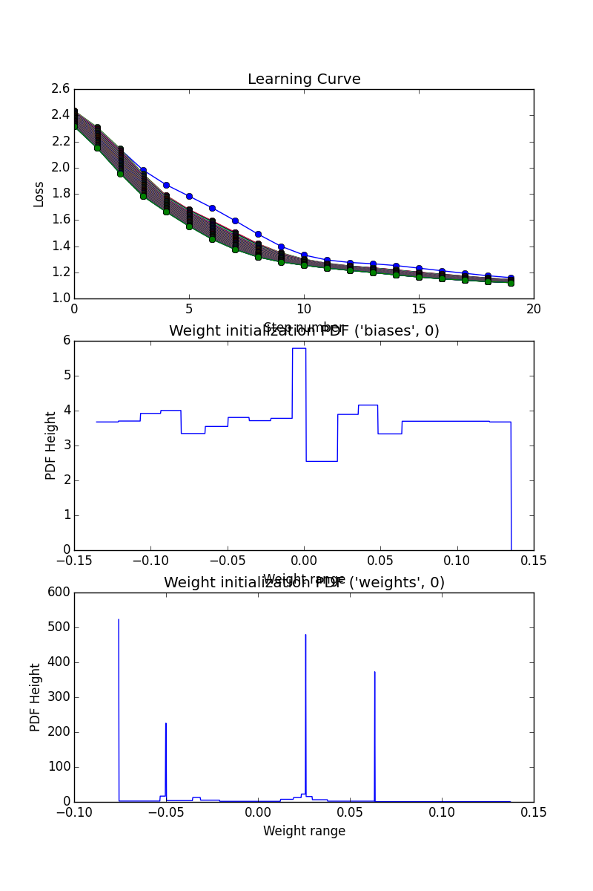

When we zoom in, the distribution actually looks pretty sensible. Perhaps some of the spikes are artefacts, bins that have no data at all?  We can get around this by plotting the emperical histogram of weights instead of the distribution we learned.

# Jan 14 experiment: trying to optimize learning rate schedule

Since gradients wrt learning rate look sensible when they start low, let's try
now to actually optimize the schedule.

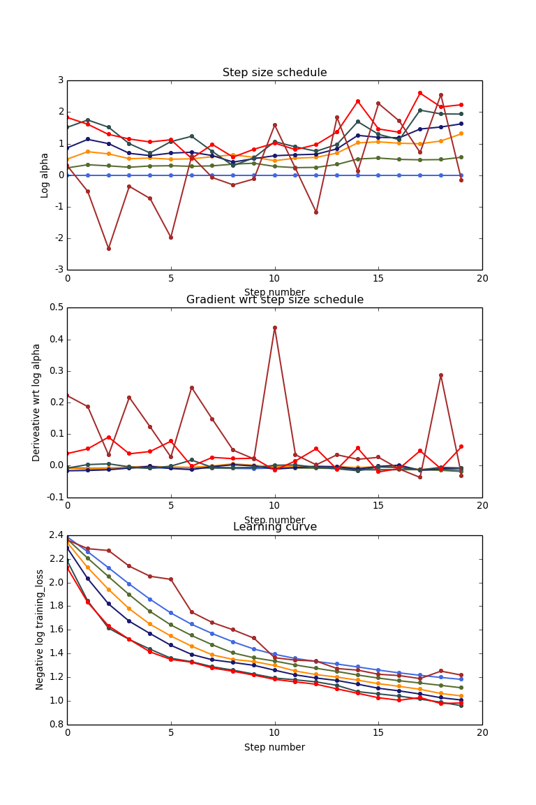

Some interesting features here. It improves at fist and then hits "chaos". The
gradients become oscillatory, so maybe the instability is only at high
frequencies? If that were true, we might just need some smoothing.

That was with a small data set (1k). Let's try with 3k.

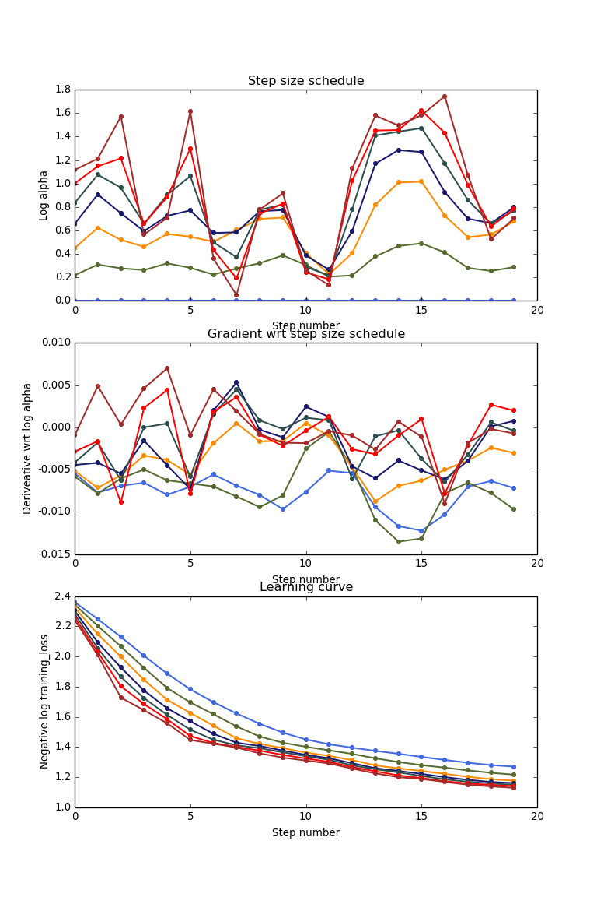

Pretty crazy. But with minibatches of 250 that's not even a full epoch. Let's
try running for much longer, but average meta gradients over minibatches.

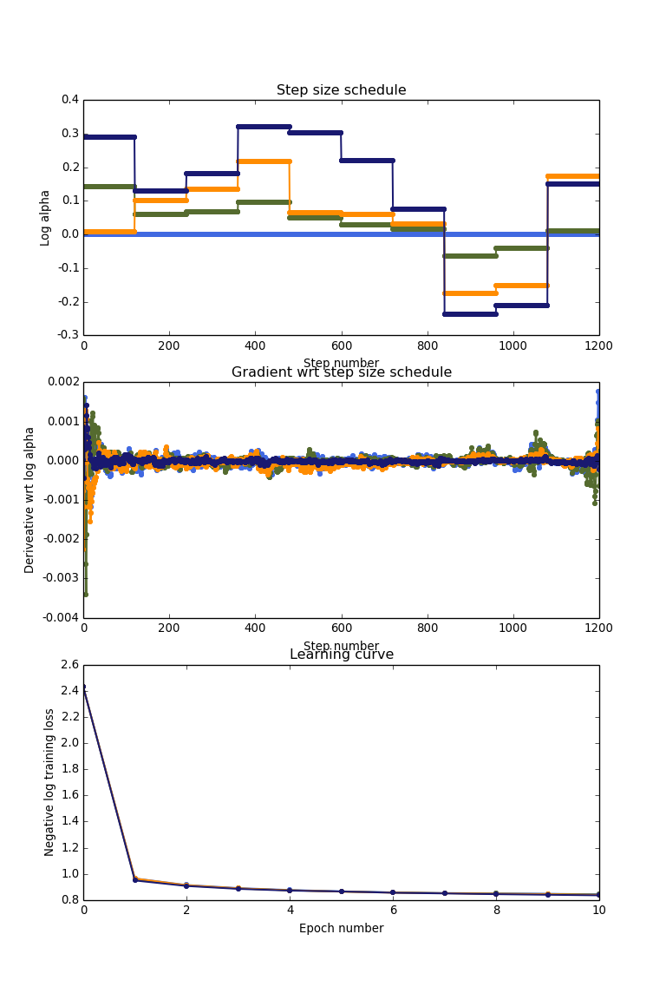

This is an interesting plot, but not quite what I expected. It hardly improves
the overall learning curve at all. Also interesting to note that the gradient is
much higher at the start and at the end. We also haf to use a very high meta
learning rate. Maybe it's not so surprising - the learning curve is very flat
towards the end, so gradients are necessarily going to be small.

<!---  ./experiments/Jan_14_learning_rate_wiggliness/README.md --->
# Jan 14 experiment: learning rate wiggliness
Let's now look at the learning rate. As before...

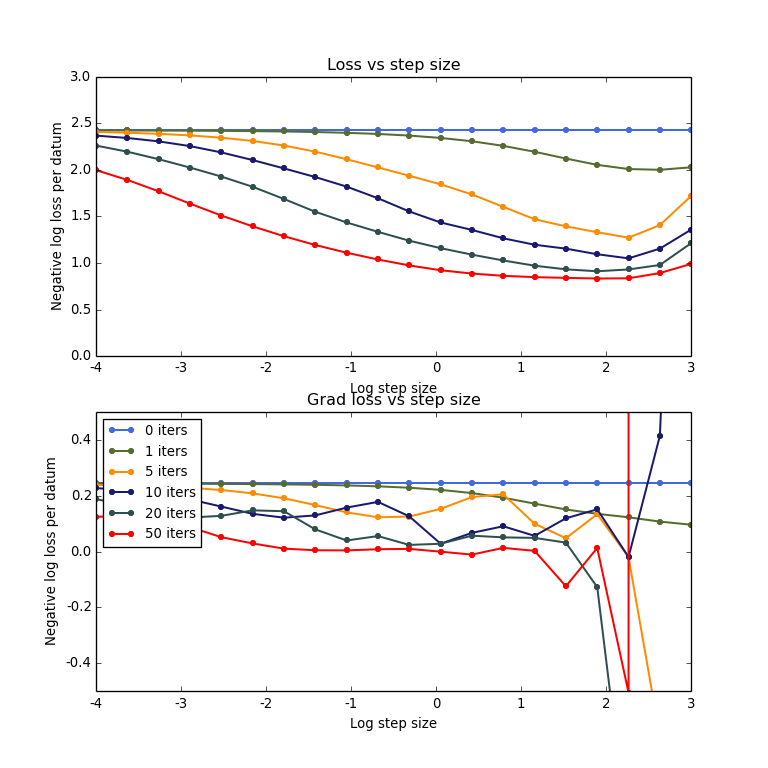

Ok, similar story as with the parameter scale. There's an "edge of chaos" to the
right but before then the gradients look pretty
sensible. [EDIT: Fixed image. The original showed the gradient wrt parameter scale.]

# Jan 11 planning

Experiments in mind:

* Trying not to stray into chaos, see if we can optimize the initial
  distribution of weights. Look at gradient wrt individual weights
  as a function of their magnitude.
* Optimize learning rate schedule.

Should probably do each of these for a few random seeds. Then we should think
about optimizing generalization.

<!---  ./experiments/Jan_9_param_scale_wiggliness/README.md --->
# Jan 9 experiment: param scale wiggliness

Investigating the wiggliness of the loss as a function of the scale of
the initial parameters.

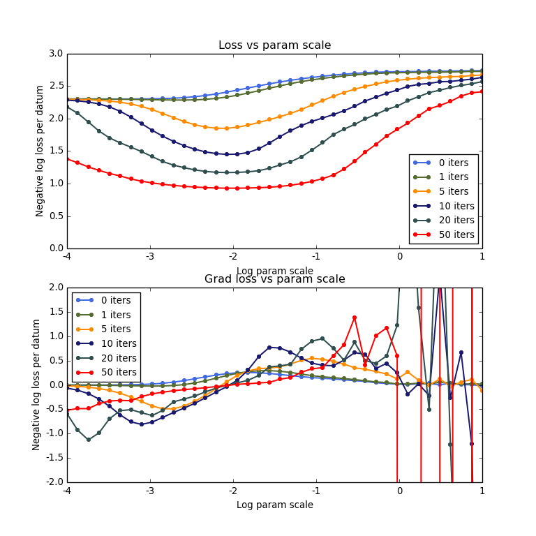

The actual loss looks very smooth but the gradient still goes
crazy. It could be numerical instability or it could conceivably be
that the apparent smoothness goes away on a sufficiently small length
scale. Testing this would be hard because numerical error will also
make it look rough on a small length scale. I think you'd want to try
looking for smooth oscillations. There's a hint of this at the 10
iteration level. Let's look at this closer, from, say, -2 to 1....

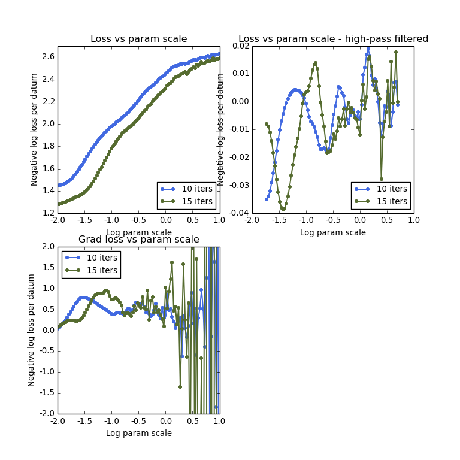

Ok, I think it's pretty clear that the function gets wiggly. But maybe
we would be ok if we stayed on the peaceful side of chaos? Let's try
more iterations...

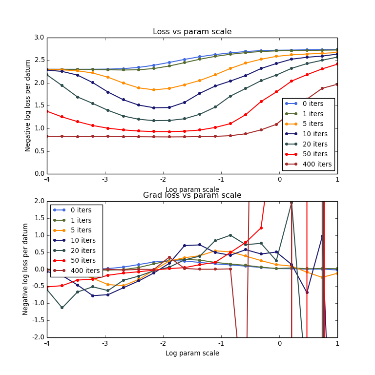

Very interesting. It really does look like the chaos chills right out
when the parameter scale is small enough.

